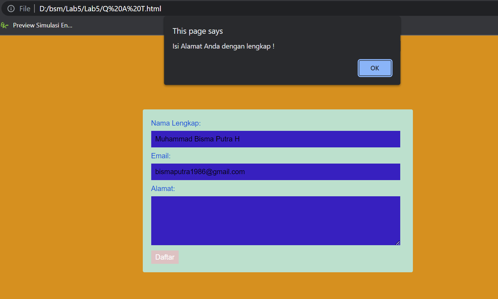

# Lab5 JavaScript
# PEMOGRAMAAN WEB

## Nama    : Muhammad Bisma Putra H
## Kelas   : TI.20.A.1
## NIM     : 312010443
________________

## MEMBUAT JAVASCRIPT

Pertama, disini saya akan membuat sebuah dokumen dasar Htmlnya terlebih dahulu, sebelum nantinya akan saya tambahkan kode untuk membuat sebuah Javascript Dasar.

)

Berikut codingan yang saya gunakan untuk membuat sebuah dokumen dasar dengan judul Pengenalan Javascript.

```html
<!DOCTYPE html>
<html lang="en">
<head>
    <title>Mengenal JavaScript</title>
</head>
<body>
    <h1>Pengenalan JavaScript</h1>
    <h3>Contoh document.write dan console.log</h3>
    <script>
        document.write("Hello World");
        console.log("Hello World");
    </script>
</body>
</html>    
```

Setelah membuat dasarnya seperti diatas, selanjutnya tambahkan sebuah kode untuk membuat JavaScript Dasar dengan pemakaian properti Alert untuk perintah pop seperti dibawah ini:

)

Dengan menggunakan kode berikut:

```html
<!DOCTYPE html>
<html lang="en">
<head>
    <meta charset="UTF-8">
    <meta http-equiv="X-UA-Compatible" content="IE=edge">
    <meta name="viewport" content="width=device-width, initial-scale=1.0">
    <title>Alert Box</title>
</head>
<body>
    <script lang="javascript">
        window.alert("ini merupakan pesan untuk anda")
    </script>
</body>
</html>
```


Dan untuk dapat menggunakan sebuah method dalam objek Javascript seperti diatas kalian dapat menambahkan kode berikut:

```html
<html lang="en">
<head>
    <meta charset="UTF-8">
    <meta http-equiv="X-UA-Compatible" content="IE=edge">
    <meta name="viewport" content="width=device-width, initial-scale=1.0">
    <title>Script Javascript</title>
</head>
<body>
    Percobaan memakai Javascript:<br>
    <script lang="javacript">
        document.write("selamat mencoba javascript<br> ");
        document.write("semoga sukses");
    </script>
</body>
</html>
```

## PEMAKAIAN PROPERTI PROMPT


Setelah ada pemakaian sebuah properti prompt window yang ada pada script seperti gambar diatas dengan menggunakannya kode dibawah ini:

```html
<html lang="en">
<head>
    <meta charset="UTF-8">
    <meta http-equiv="X-UA-Compatible" content="IE=edge">
    <meta name="viewport" content="width=device-width, initial-scale=1.0">
    <title>Pemasukan Data</title>
</head>
<body>
    <script lang="javascript">
        var nama = prompt("siapa nama anda?","masukkan nama anda!");
        document.write("hai, "+ nama);
    </script>
</body>
</html>
```


Kemudian untuk dapat menggunakan function dengan body onload di javascript seperti gambar diatas kalian perlu menggunakan kode berikut:

```html
<html lang="en">
<head>
    <meta charset="UTF-8">
    <meta http-equiv="X-UA-Compatible" content="IE=edge">
    <meta name="viewport" content="width=device-width, initial-scale=1.0">
    <title>Contoh Program Javascript</title>
    <script lang="javascript">
        function pesan (){
            alert("memanggil javascript lewat body ")
        }
    </script>
</head>
<body onload=pesan()>
    
</body>
</html>
```

## MEMBUAT OPERASI DASAR ARITMETIC


Untuk dapat membuat sebuah operasi aritmetic, langkah awal yang perlu dilakuan ialah memasukan sebuah kode dibawah ini, Berikut kode yang saya gunakan untuk membuat sebuah tampilan aritmetic seperti gambar diatas:

```html
<!DOCTYPE html>
<html lang="en">
<head>
    <meta charset="UTF-8">
    <meta http-equiv="X-UA-Compatible" content="IE=edge">
    <meta name="viewport" content="width=device-width, initial-scale=1.0">
    <title>Contoh Program Javascript</title>
    <script lang="javascript">
        function test (val1,val2)
        {
            document.write("<br>"+"perkalian : val1*val2"+"<br>")
            document.write(val1*val2)
            document.write("<br>"+"pembagian : val1*val2"+"<br>")
            document.write(val1/val2)
            document.write("<br>"+"penjumlahan : val1*val2"+"<br>")
            document.write(val1+val2)
            document.write("<br>"+"pengurangan : val1*val2"+"<br>")
            document.write(val1-val2)
            document.write("<br>"+"modulus : val1*val2"+"<br>")
            document.write(val1%val2)
        }
    </script>
</head>
<body>
    <input type="button" value="aritmetic" name="aritmetic" onclick=test(9,4)>
</body>
</html>
```


Setelahnya, kalian dapat melakukan seleksi kondisi dengan langkah awal yaitu memilih sebuah angka random yang nantinya akan menjadi syarat lulus atau tidaknya program Javascriptnya seperti gambar diatas yang mana disini saya memilih angka 60 keatas untuk dinyatakan LULUS dan dibawah 60 dinyatakan TIDAK LULUS. Disini saya mencobanya dengan memasukan angka 70. Dan berikut hasilnya:


Untuk dapat membuat sebuah program seleksi diatas dibutuhkannya kode berikut:

```html
<!DOCTYPE html>
<html lang="en">
<head>
    <meta charset="UTF-8">
    <meta http-equiv="X-UA-Compatible" content="IE=edge">
    <meta name="viewport" content="width=device-width, initial-scale=1.0">
    <title>Contoh if-else</title>
</head>
<body>
    <script lang="javascript">
        var nilai = prompt("nilai (0-100): ", 0)
        var hasil = "";
        if (nilai >=60)
        hasil = "lulus";
        else
        hasil = "tidak lulus"
        document.write("hasil: " + hasil);
    </script>
</body>
</html>
```

## PENGGUNAAN OPERATOR SWITCH UNTUK MENYELEKSI KONDISI


Untuk dapat melakukan sebuah Operator Switch untuk nantinya menyeleksi kondisi seperti diatas, yang mana kita dapat memilih angka dari 1 hingga sepuluh yang nantinya akan ditampilkan hasil bilangan yang sesuai dengan angka yang kita pilih. Seperti gambar diatas yang mana saya memilih angka 10 dengan hasil seperti gambar dibawah yang menampilkan 'Bilangan Sepuluh' yang sesuai dengan apa yang kita tuliskan diatas.


Dan untuk dapat membuatnya dibutuhkannya kode berikut:

```html
<!DOCTYPE html>
<html lang="en">
<head>
    <meta charset="UTF-8">
    <meta http-equiv="X-UA-Compatible" content="IE=edge">
    <meta name="viewport" content="width=device-width, initial-scale=1.0">
    <title>Contoh Program Javascript</title>
    <script lang="javascript">
        function test ()
        {
            val1=window.prompt("input nilai (1-10) :")
            switch (val1)
            {
                case "1" :
                    document.write("bilangan satu")
                    break
                case "2" :
                    document.write("bilangan dua")
                    break
                case "3" :
                    document.write("bilangan tiga")
                    break
                case "4" :
                    document.write("bilangan empat")
                    break
                case "5" :
                    document.write("bilangan Lima")
                    break
                case "6" :
                    document.write("bilangan Enam")
                    break
                case "7" :
                    document.write("bilangan Tujuh")
                    break
                case "8" :
                    document.write("bilangan Delapan")
                    break
                case "9" :
                    document.write("bilangan Sembilan")
                    break
                case "10" :
                    document.write("Bilangan Sepuluh")
                    break
                default :
                    document.write("bilangan lainnya")
            }
        }
    </script>
</head>
<body>
    <input type="button" value="switch" onclick=test()>
</body>
</html>
```

## PEMBUATAN FORM INPUT


Dalam pembuatan Form Input sedikit mirip secara garis besar dengan Penggunaan Operator seperti diatas, yang mana lagi lagi kalian perlu memasukan sebuah angka untuk dapat dicek apakah angka tersebut masuk kedalam bilangan ganjil ataupun genap. Seperti diatas yang mana saya mencoba memasukan angka 10 untuk dapat ditebak kebenarannya mengenai masuk kebilangan apa angka 10 itu, dan berikut hasilnya:


Berikut kode-kode yang saya gunakan untuk dapat membuat sebuah Form Input diatas:

```html
<!DOCTYPE html>
<html lang="en">
<head>
    <meta charset="UTF-8">
    <meta http-equiv="X-UA-Compatible" content="IE=edge">
    <meta name="viewport" content="width=device-width, initial-scale=1.0">
    <title>Form Input</title>
    <script lang="javascript">
        function test () {
            var val1=document.kirim.T1.value
            if (val1%2==0)
                document.kirim.T2.value="bilangan genap"
            else
                document.kirim.T2.value="bilangan ganjil"
        }
    </script>
</head>
<body>
    <form action="" method="post" name="kirim">
        <p>BIL <input type="text" name="T1" id="T1" size="20"> MERUPAKAN BIL <input type="text" name="T2" id="T2" size="20"></p>
        <p><input type="button" value="TEBAK" name="B1" onclick=test()></p>
    </form>
</body>
</html>
```

## PEMBUATAN FORM BUTTON


 Jika sebelumnya kita telah membuat sebuah Form input, maka selanjutnya kita membuat sebuah Form Button yang dimana disini membutnya menggunakan function Javascript dan html Form Button yang akan menampilkan hasil seperti gambar diatas. Kalian juga dapat mengaturnya menjadi warna yang kalian inginkan seperti misal Background hitam dengan teks merah, background pink dengan teks ungu. Atau bisa juga kalian menukarnya menjadi background pink dengan teks merah dsb.


Berikut kode-kode yang saya gunakan untuk dapat membuat sebuah Form Button diatas:

```html
<!DOCTYPE html>
<html lang="en">
<head>
    <meta charset="UTF-8">
    <meta http-equiv="X-UA-Compatible" content="IE=edge">
    <meta name="viewport" content="width=device-width, initial-scale=1.0">
    <title>Objek Document</title>
</head>
<body>
    <script lang="javascript">
        function ubahWarnaLB(warna) {
            document.bgColor = warna;
        }
        function ubahWarnaLD(warna) {
            document.fgColor = warna;
        }
    </script>
    <h1>Tes</h1>
    <form action="">
        <input type="button" value="Latar Belakang Hitam" onclick="ubahWarnaLB('BLACK')">
        <input type="button" value="Latar Belakang Merah Muda" onclick="ubahWarnaLB('PINK')">
        <input type="button" value="Teks Merah" onclick="ubahWarnaLD('RED')">
        <input type="button" value="Teks ungu" onclick="ubahWarnaLD('PURPLE')">
    </form>
    <script lang="javascript">
        document.write("Dimodifikasi terakhir pada " + document.lastModified);
    </script>
</body>
</html>
```

## PERHITUNGAN OTOMATIS HTML DOM MENGGUNAKAN CHECKBOX


Untuk membuat sebuah Html DOM dengan input type Checkbox seperti diatas yang nantinya akan dijumlahkan secara otomatis begitu kalian memilih beberapa menu, maka kalian memerluka kode berikut untuk dapat membuatnya.

```html
<!DOCTYPE html>
<!-- file daftar menu.html -->
<html lang="en">
<head>
    <meta charset="UTF-8">
    <meta http-equiv="X-UA-Compatible" content="IE=edge">
    <meta name="viewport" content="width=device-width, initial-scale=1.0">
    <title>Daftar Menu Ticket</title>
    <script lang="javascript">
        function hitung(ele) {
            var total = document.getElementById('total').value;
                total = (total ? parseInt(total) : 0);
            var harga = 0;

            if (ele.checked) {
                harga = ele.value;
                total += parseInt(harga);
            } else {
                harga = ele.value;
                if (total > 0)
                    total -= parseInt(harga);
            }
            document.getElementById('total').value = total;
        }
    </script>
</head>
<body>
    <h1>Daftar Harga Ticket Concert</h1>
    <label><input type="checkbox" value="5000000" name="menu1" id="menu1" onclick="hitung(this);">VVIP Rp. 5.000.000</label><br>
    <label><input type="checkbox" value="4000000" name="menu2" id="menu2" onclick="hitung(this);">RED ZONE Rp. 4.000.000</label><br>
    <label><input type="checkbox" value="2500000" name="menu3" id="menu3" onclick="hitung(this);">BLUE ZONE Rp. 2.500.000</label><hr>
    <strong>Total Bayar: Rp. <input type="text" name="total" id="total"></strong>
</body>
</html>
```


# QUESTION AND TASK

1. Buat script untuk melakukan validasi pada isian form!


Adapun yang akan terjadi apabila kalian tidak mengisi kolom alamat pada gambar diatas maka akan ditampilkan sebuah warning pop seperti gambar dibawah ini



Dan untuk dapat membuat tampilan seperti gambar diatas, disini saya menggunaka kode-kode seperti dibawah ini:

```html
<!DOCTYPE html>
<html lang="en">
<head>
	<title>Form Validasi</title>
	<link rel="stylesheet" type="text/css" href="tugas.css">
    <script type="text/javascript">
        function validasiForm() {
            var nama = document.getElementById("nama").value;
            var email = document.getElementById("email").value;
            var alamat = document.getElementById("alamat").value;
            if (nama != "" && email!="" && alamat !="") {
                return true;
            }else{
                alert('Isi Alamat Anda dengan lengkap !');
                return false;
            }
        }
    </script>
</head>
<body>
	<div class="login">
		<form action="beranda.html" method="POST" onsubmit="return validasiForm()">
			<div>
				<label>Nama Lengkap:</label>
				<input type="text" name="nama" id="nama" />
			</div>
			<div>
				<label>Email:</label>
				<input type="email" name="email" id="email" />
			</div>
			<div>
				<label>Alamat:</label>
				<textarea cols="40" rows="5" name="alamat" id="alamat"></textarea>
			</div>
			<div>
				<input type="submit" value="Daftar" class="tombol">
			</div>
		</form>
	</div>
</body>
</html>
```

Dan untuk settingan css yang saya gunakan seperti ini kodenya:

```css
body {
    background: #89d0d0;
    font-family: sans-serif;
    padding: 100px;
  }
  
  

  .login {
    padding: 1em;
    margin: 2em auto;
    width: 30em;
    background: rgb(188, 224, 205);
    border-radius: 3px;
  }
  
  label {
    font-size: 10pt;
    color: rgb(131, 143, 169);
  } 
  
  input[type="text"],
  input[type="email"],
  textarea {
    padding: 8px;
    width: 95%;
    background: #ffffff;
    border: 0;
    font-size: 10pt;
    margin: 6px 0px; 
  }
   
  .tombol {
    background: #4e7a97;
    color: #fff;
    border: 0;
    padding: 5px 8px;
  } 
   .tombol:hover{
      background-color: rgb(221, 194, 194);
  }
```  

# <P align="center"> TERIMA KASIH

